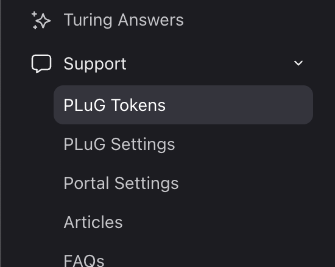

## Table of contents
- [Requirements](#requirements)
- [Setup](#setup)
- [Initialize DevRev SDK](#setting-up-the-devrev-sdk)
- [Features](#features)
- [Sample app](#sample-app)
- [Troubleshooting](#troubleshooting)


# Requirements

- Android Studio 2022.1.1
- Android Gradle Plugin version 7.4
- Gradle version 7.6
- Minimum Android SDK 29

# Setup

## Step 1

Add the following dependencies to your app's `build.gradle.kts` file to get the latest version of our SDK:
```kotlin
dependencies {
    implementation("ai.devrev.sdk:core:<version>")
}
```

## Step 2
Our SDK is hosted on mavenCentral, so to gain access to it, just include the mavenCentral to your root's `build.gradle.kts` file.
```kotlin
repositories {
    mavenCentral()
}
```
After this step, it should be possible to import and use the DevRev SDK in your Android application.

After adding the lines about in your `build.gradle.kts` script you should be able to import and use the DevRev SDK.


# Setting up the DevRev SDK
## Step 1: Credentials
In order to use the DevRev SDK you need to provide credentials that can be found in the DevRev web app settings pages.
Open the Settings screen (gear icon), and then go to PLuG Tokens under Support.



Under the App ID and Secret section you can create the credentials for use in the SDK.  Store the **App ID** and 
**Secret** as this will be used in the SDK configuration.


Then you will need to obtain the **PLuG App ID** (referred to as `supportID` in the code) by going to the **PLuG Settings** page.


## Step 2: Initialization
Once you have the credentials, you can configure the DevRev SDK in your app.

To configure the SDK, you need to call the following method inside your `Application` class:

```kotlin
fun DevRev.configure(
    context: Context,
    appID: String,
    secret: String,
    supportId: String
)
```

In case you do not have a custom `Application` class, you have to extend one like in the following example:

```kotlin
import ai.devrev.sdk.DevRev

class FooApplication : Application() {

    override fun onCreate() {
        super.onCreate()
        DevRev.configure(
            context = this,
            appId = "<APP_ID>",
            secret = "<SECRET>",
            supportId = "<SUPPORT_ID>",
        )
    }
}
```
In the `onCreate` method in your `Application`, you need to configure the DevRev SDK with the required parameters. Here you need to use the credentials that we have created before.

Moreover, the custom application should be defined in `AndroidManifest.xml` like in the following example:
```xml
<application
    android:name=".FooApplication">
</application>
```

# Features
Before start using the PLuG chat feature, user identification is required. There are many arguments mobile applications can submit in order to identify the user. The following example takes the most simplistic approach and provides a bare minimum of arguments required for successful user identification:
```kotlin
DevRev.identify(
    userIdentification = UserIdentification(userId = "foo@example.org")
)
```
Please read PluG API documentation to learn more about user identification options.

After completing user identification, it is possible to start using the chat (conversations) dialog supported by our DevRev SDK.

In order to open the chat dialog, application should use `showSupport` API, as demonstrated in the following example:

```kotlin
DevRev.showSupport(context: Context)
```

Mobile PluG SDK also exposes the support button, which can be added to your application. Including it in the current screen requires adding the following code in your XML layout:
```xml
<ai.devrev.sdk.plug.view.PlugFloatingActionButton
    android:id="@+id/plug_fab"
    android:layout_width="wrap_content"
    android:layout_height="wrap_content"
    android:layout_margin="24dp"
    app:layout_constraintBottom_toBottomOf="parent"
    app:layout_constraintEnd_toEndOf="parent" />
```
The support button can also accept default parameters like
```kotlin
android:src="@your_drawable_here"
```
and/or
```kotlin
android:backgroundTint="@your_background_color"
```
so that you can customize it to your own needs.
The button will show up on your screen. The button will show up on your screen. Please check the following screenshot to visualize how the support button is expected to look in our application:


At this point, it should be possible to run the app and use all the functionalities of the DevRev PLuG SDK. Pressing the support button would navigate user to the chat.


# Sample app
Please note that all examples presented in this document are generated using DevRev SDK sample app. The sample app with examples for both function and XML implementation has been provided as part of this repository. Users are kindly encouraged to run the sample app before integrating PluG SDK in the destination application.

# Troubleshooting
In case of any issues with the integration of the DevRev SDK, please verify that the dependency is correctly set in the project. In addition, please make sure that mavenCentral is reachable from the IDE and that the DevRev PluG SDK version of choice was correctly detected.

In case the `showSupport()` function or XML button are not responding, make sure the user has been identified beforehand.

To ensure correct operation, correctly setting App ID and secrete is of paramount importance. Please double-check that both values are correctly configured in your application or sample app.
