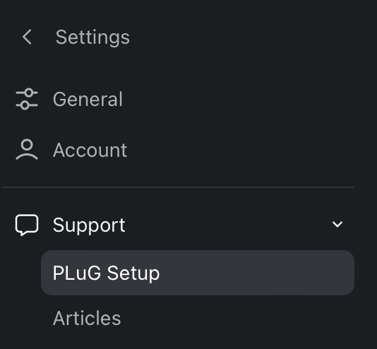
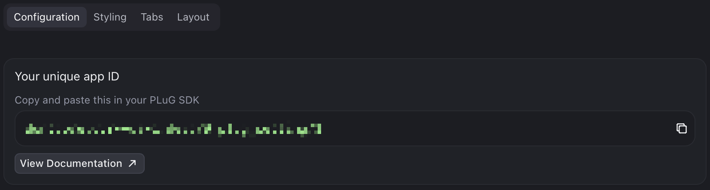
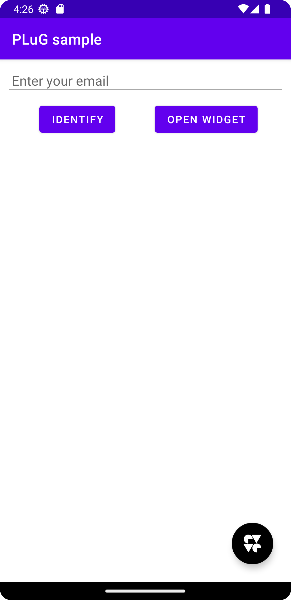
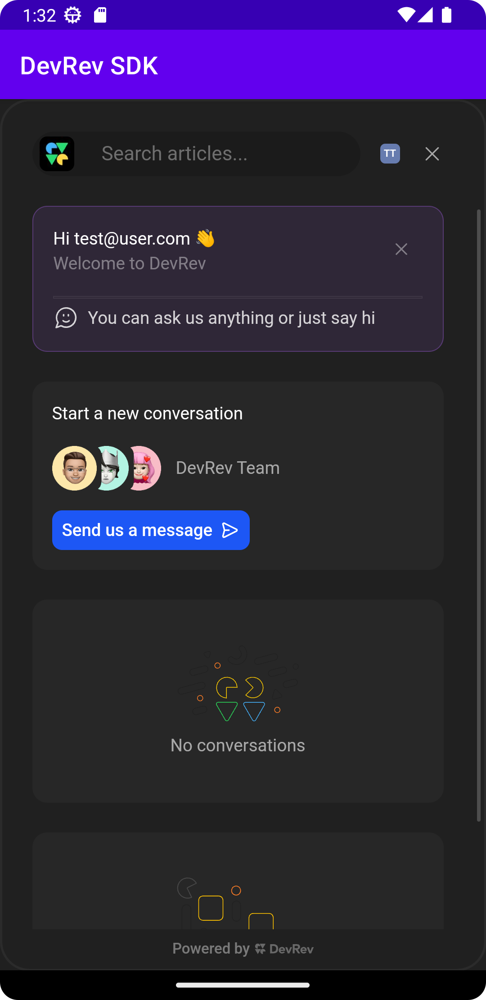

## Table of contents
- [Table of contents](#table-of-contents)
- [Requirements](#requirements)
- [Integration](#integration)
  - [Step 1: App level dependencies](#step-1)
  - [Step 2: Project level dependencies](#step-2)
- [Setting up the DevRev SDK](#setting-up-the-devrev-sdk)
  - [Step 1: Credentials](#step-1-credentials)
  - [Step 2: Configuration](#step-2-configuration)
- [Features](#features)
  - [Identification](#identification)
    - [Anonymous identification](#anonymous-identification)
    - [Unverified identification](#unverified-identification)
    - [Examples](#examples)
  - [PLuG support chat](#plug-support-chat)
  - [Analytics](#analytics)
    - [Examples](#examples-1)
  - [Observability](#observability)
    - [Opting in/out](#opting-inout)
    - [Session recording](#session-recording)
    - [Session properties](#session-properties)
    - [Timers](#timers)
      - [Examples](#examples-2)
    - [Screen tracking](#screen-tracking)
      - [Examples](#examples-3)
    - [Push notifications](#push-notifications)
      - [Registering for push notifications](#registering-for-push-notifications)
      - [Unregistering from push notifications](#unregistering-from-push-notifications)
      - [Handling push notifications](#handling-push-notifications)
        - [Examples](#examples-4)
- [Sample app](#sample-app)
- [FAQ](#faq)


# Requirements

- Android Studio 2022.1.1 or later
- Android Gradle Plugin version 7.4 or later
- Gradle version 7.6 or later
- Minimum Android SDK 24

# Integration

## Step 1

- Kotlin

Add the following dependencies to your app's `build.gradle.kts` file to get the latest version of our SDK:
```kotlin
dependencies {
    implementation("ai.devrev.sdk:devrev-sdk:<version>")
}
```

- Groovy

Add the following dependencies to your app's `build.gradle` file to get the latest version of our SDK:
```groovy
dependencies {
    implementation 'ai.devrev.sdk:devrev-sdk:<version>'
}
```

## Step 2
Our SDK is hosted on mavenCentral, so to gain access to it, just include the mavenCentral to your root's `build.gradle.kts` (Kotlin) or `build.gradle` (Groovy) file.
```kotlin
repositories {
    mavenCentral()
}
```
After this step, it should be possible to import and use the DevRev SDK in your Android application.

After adding the lines about in your `build.gradle.kts` Kotlin or `build.gradle` Groovy script you should be able to import and use the DevRev SDK.


# Setting up the DevRev SDK
## Step 1: Credentials
1. Open the **Settings** page.


   


2. Open the **PLuG Settings** page, and copy the value under **Your Unique App ID**.


   
   <br />
   

## Step 2: Configuration

> [!IMPORTANT]
> The SDK must be configured before you can use any of its features.

Once you have the credentials, you can configure the DevRev SDK in your app. The SDK will be ready to use once you have called the configuration method:
- Kotlin
```kotlin
DevRev.configure(context: Context, appId: String)
```
- Java
```java
DevRev.INSTANCE.configure(Context context, String appId);
```
To configure the SDK, you need to call the following method inside your `Application` class:

> [!NOTE]
> In case you do not have a custom `Application` class, you have to extend one like in the following example:

- Kotlin
```kotlin
import ai.devrev.sdk.DevRev

class FooApplication : Application() {

    override fun onCreate() {
        super.onCreate()
        DevRev.configure(
            context = this,
            appId = "<APP_ID>"
        )
    }
}
```

- Java
```java
import ai.devrev.sdk.DevRev;

public class FooApplication extends Application {

    @Override
    public void onCreate() {
        super.onCreate();
        DevRev.INSTANCE.configure(
            this,
            "<APP_ID>"
        );
    }
}
```

In the `onCreate` method in your `Application`, you need to configure the DevRev SDK with the required parameters. Here you need to use the credentials that we have created before.

Moreover, the custom application should be defined in `AndroidManifest.xml` like in the following example:
```xml
<application
    android:name=".FooApplication">
</application>
```

# Features
## Identification
Certain features of the DevRev SDK **require** a user identification. There are two methods to identify your users:
- **Anonymous users**: Creates an anonymous user with an optional user identifier, no other data is stored or associated with the user.
- **Unverified users**: Identifies the user with a unique identifier, but does not verify the user's identity with the DevRev backend.

> [!IMPORTANT]
> The user, organization and account traits in the `Identity` structure also support custom fields, which need to be configured in the DevRev web app before they can be used. For more information, see [Object customization](https://devrev.ai/docs/product/object-customization).

### Anonymous identification
The anonymous identification method is used to create an anonymous user with a random user identifier.

- Kotlin

```kotlin
DevRev.identifyAnonymousUser(
    userId: String
)
```

- Java

```java
DevRev.INSTANCE.identifyAnonymousUser(
    String userId
);
```

### Unverified identification
The unverified identification method is used to identify the user with a unique identifier, but does not verify the user's identity with the DevRev backend.

- Kotlin

```kotlin
DevRev.identifyUnverifiedUser(
    identity: Identity
)
```

- Java

```java
DevRev.INSTANCE.identifyUnverifiedUser(
    Identity identity
);
```

The function accepts the `Identity` object, with the user identifier (`userId`) as the only required property, all other properties are optional.

### Examples

- Kotlin

```kotlin
// Identify an anonymous user without a user identifier.
DevRev.identifyAnonymousUser("abcd1234")

// Identify an unverified user with its email address an user identifier.
DevRev.identifyUnverifiedUser(Identity(userId = "foo@example.org"))
```

- Java

```java
// Identify an anonymous user without a user identifier.
DevRev.INSTANCE.identifyAnonymousUser("abcd1234");

// Identify an unverified user with its email address an user identifier.
DevRev.identifyUnverifiedUser(
        new Identity("foo@example.org", null, null, null, null, null)
);
```

The identification function should be placed at the appropriate place in your app after you login your user. If you have the user information at app launch, call the function after the `DevRev.configure(context, appID)` method.

#### Updating the user
You can update the user's information using the following method:

- Kotlin

```kotlin
DevRev.updateUser(
    identity: Identity
)
```

- Java

```java
DevRev.INSTANCE.updateUser(
    Identity identity
);
```

The function accepts the `DevRev.Identity` ojbect.

> [!IMPORTANT]
> The `userID` property can *not* be updated.


## PLuG support chat

After completing user identification, it is possible to start using the chat (conversations) dialog supported by our DevRev SDK.

In order to open the chat dialog, application should use `showSupport` API, as demonstrated in the following example:

- Kotlin

```kotlin
DevRev.showSupport(context: Context)
```

- Java

```java
DevRevExtKt.showSupport(DevRev.INSTANCE, context);
```

DevRev SDK also exposes the support button, which can be added to your application. Including it in the current screen requires adding the following code in your XML layout:
```xml
<ai.devrev.sdk.plug.view.PlugFloatingActionButton
    android:id="@+id/plug_fab"
    android:layout_width="wrap_content"
    android:layout_height="wrap_content"
    android:layout_margin="24dp"
    app:layout_constraintBottom_toBottomOf="parent"
    app:layout_constraintEnd_toEndOf="parent" />
```
The support button can also accept default parameters like
```kotlin
android:src="@your_drawable_here"
```
and/or
```kotlin
android:backgroundTint="@your_background_color"
```
so that you can customize it to your own needs.
The button will show up on your screen. The button will show up on your screen. Please check the following screenshot to visualize how the support button is expected to look in our application:



At this point, it should be possible to run the app and use all the functionalities of the DevRev PLuG SDK. Pressing the support button would navigate user to the chat.



## Analytics
The DevRev SDK supports sending custom analytic events using a name and a string hashmap.

You can track them using the following function:

- Kotlin
```kotlin
DevRev.trackEvent(name: String, properties: HashMap<String, String>)
```
- Java
```java
DevRevAnalyticsExtKt.trackEvent(DevRev instance, String name, HashMap<String, String> properties);
```

#### Examples

- Kotlin
```kotlin
DevRev.trackEvent(name = "open-message-screen", properties = {"id": "foo-bar-1337"})
```
- Java
```java
DevRevAnalyticsExtKt.trackEvent(DevRev.INSTANCE, "open-message-screen", new HashMap<>().put("id", "foo-bar-1337"));
```
## Observability
The DevRev SDK provides observability features to help you understand how your users are interacting with your app.

### Opting in/out
The end user can give the consent to opt in/out of the observability feature.

- Kotlin
```kotlin
DevRev.stopAllMonitoring()
```
- Java
```java
DevRevObservabilityExtKt.stopAllMonitoring(DevRev.INSTANCE);
```
This method stops and deletes the current session recording and also disables the session recording by our SDK for this user in the future.

- Kotlin
```kotlin
DevRev.resumeAllMonitoring()
```
- Java
```java
DevRevObservabilityExtKt.resumeAllMonitoring(DevRev.INSTANCE);
```
If the user was disabled for session recording by using the stopAllMonitoring() method, you can use this method to enable recording at runtime.
> [!NOTE]
> This feature will only store a monitoring permission flag, it will **not** provide any UI or dialog.

### Session recording
You can enable session recording to record user interactions with your app.

> [!CAUTION]
> The session recording feature is opt-out and is enabled by default.

The session recording feature has a number of methods to help you control the recording:

| Kotlin                   | Java                                                               | Action                                                    |
|--------------------------|--------------------------------------------------------------------|-----------------------------------------------------------|
| DevRev.startRecording()  | DevRevObservabilityExtKt.startRecording(DevRev.INSTANCE, context); | Starts the session recording.                             |
| DevRev.stopRecording()   | DevRevObservabilityExtKt.stopRecording(DevRev.INSTANCE);           | Stops the session recording and uploads it to the portal. |
| DevRev.pauseRecording()  | DevRevObservabilityExtKt.pauseRecording(DevRev.INSTANCE);          | Pauses the ongoing session recording.                     |
| DevRev.resumeRecording() | DevRevObservabilityExtKt.resumeRecording(DevRev.INSTANCE);         | Resumes a paused session recording.                       |

### Session properties
You can add custom properties to the session recording to help you understand the context of the session. The properties are defined as a dictionary of string values.

- Kotlin
```kotlin
DevRev.addSessionProperties(properties: HashMap<String, Any>)
```
- Java
```java
DevRevObservabilityExtKt.addSessionProperties(DevRev.INSTANCE, HashMap<String, Object> properties);
```
You also have the ability to clear the session properties in scenarios like user logout or when the session ends.

- Kotlin
```kotlin
DevRev.clearSessionProperties()
```
- Java
```java
DevRevObservabilityExtKt.clearSessionProperties(DevRev.INSTANCE);
```

### Timers
As part of the observability features, the DevRev SDK provides a timer mechanism to help you measure the time spent on a specific task. Events such as response time, loading time, or any other time-based event can be measured using the timer.

The mechanism works using balanced start and stop methods that both accept a timer name and an optional dictionary of properties.

Start a timer using the method:

- Kotlin
```kotlin
DevRev.startTimer(name: String, properties: HashMap<String, String>)
```
- Java
```java
DevRevObservabilityExtKt.startTimer(DevRev.INSTANCE, String name, HashMap<String, String> properties);
```

And balance it with the stop method:

- Kotlin
```kotlin
DevRev.endTimer(name: String, properties: HashMap<String, String>)
```
- Java
```java
DevRevObservabilityExtKt.endTimer(DevRev.INSTANCE, String name, HashMap<String, String> properties);
```

#### Examples

- Kotlin
```kotlin
DevRev.startTimer("response-time", properties: {"id": "foo-bar-1337"})

// Perform the task that you want to measure.

DevRev.endTimer("response-time", properties: {"id": "foo-bar-1337"})
```
- Java
```java
DevRevObservabilityExtKt.startTimer(DevRev.INSTANCE, "response-time", new HashMap<String, String>().put("id", "foo-bar-1337"));

// Perform the task that you want to measure.

DevRevObservabilityExtKt.endTimer(DevRev.INSTANCE, "response-time", new HashMap<String, String>().put("id", "foo-bar-1337"));
```

### Screen tracking
The DevRev SDK provides automatic screen tracking to help you understand how users are navigating through your app. While activities are automatically tracked, you can also manually track screens/fragments using the following method:

- Kotlin
```kotlin
DevRev.trackScreenName(screenName: String)
```
- Java
```java
DevRevObservabilityExtKt.trackScreenName(DevRev.INSTANCE, String screenName);
```

#### Examples

- Kotlin
```kotlin
DevRev.trackScreenName("profile-screen")
```
- Java
```java
DevRevObservabilityExtKt.trackScreenName(DevRev.INSTANCE, "profile-screen");
```

## Push notifications

You can configure your app to receive push notifications from the DevRev SDK. The SDK is able to handle push notifications and perform actions based on the content of the notification.

The DevRev backend sends push notifications to your app to notify users about new messages in the PLuG support chat. In the future, the push notification support will be expanded with additional features.

> [!CAUTION]
> TBD @Ribhu has to provide the integration guide for push notifications.
In order to receive push notifications, you need to configure your DevRev organization by following the [Push Notifications integration guide](#).

You need to make sure that your Android app is configured to receive push notifications. You can follow the [Firebase documentation](https://firebase.google.com/docs/cloud-messaging/android/client) to set up your app to receive push notifications.

### Registering for push notifications

> [!IMPORTANT]
> Push notifications require that the SDK has been configured and the user has been identified (unverified and anonymous users). The user identification is required to send the push notification to the correct user.

The DevRev SDK provides a method to register your device for receiving push notifications. You can call the following method to register for push notifications:

- Kotlin
```kotlin
DevRev.registerDeviceToken(
  context: Context,
  deviceToken: String,
  deviceId: String
)
```
- Java
```java
DevRev.INSTANCE.registerDeviceToken(
  Context context,
  String deviceToken,
  String deviceId
);
```
The method requires a device identifier, which is persistent across device restarts and app launches. This can be a Firebase installation ID, Android ID, or an identifier unique to your system.

To obtain the device token for Firebase Cloud Messaging:

1. Use the `FirebaseMessaging` object.
2. Call the `firebaseMessaging.token.await()` method.
3. This method will generate and return the device token.

```kotlin
val firebaseMessaging = FirebaseMessaging.getInstance()
val token = firebaseMessaging.token.await()
// Use the token as needed
```

### Unregistering from push notifications

In cases when your app no longer wants to receive push notifications, you can unregister the device from receiving them. The method to unregister the device is:

- Kotlin
```kotlin
DevRev.unregisterDevice(
  context: Context,
  deviceId: String
)
```
- Java
```java
DevRev.INSTANCE.unregisterDevice(
  Context context,
  String deviceId
);
```

The method requires the device identifier, which is the same as the one used for registering the device.

### Handling push notifications

The DevRev SDK currently doesn't supports automatic handling of push notifications. The message payload received in the notification needs to be passed to the SDK to automatically open the PLuG chat and handle navigation internally.

- Kotlin
```kotlin
DevRev.processPushNotification(
    context: Context,
    userInfo: String
)
```
- Java
```java
DevRev.INSTANCE.processPushNotification(
    Context context,
    String userInfo
);
```
In order to extract the notification payload:
1. In Firebase Cloud Messaging (FCM), when a push notification is received, it triggers the `onMessageReceived` function in your `FirebaseMessagingService` class.
2. This function receives a `RemoteMessage` object as a parameter, which contains the notification data.
3. The `RemoteMessage` object has a property called data, which is a map containing key-value pairs of the notification payload.
4. To extract a specific piece of data from the payload, you can use the key to access the value in the data map.
5. In this case, to get the "message" from the payload, you would use:

- Kotlin
```kotlin
val message = remoteMessage.data["message"]
```

- Java
```java
String messageData = remoteMessage.getData().get("message");
```

#### Examples

- Kotlin
```kotlin
class MyFirebaseMessagingService: FirebaseMessagingService {
    // ...

    override fun onMessageReceived(remoteMessage: RemoteMessage) {
        // ...
        val messageData = remoteMessage.data["message"]
        DevRev.processPushNotification(messageData)
    }
}
```
- Java
```java
public class MyFirebaseMessagingService extends FirebaseMessagingService {
    // ...

    @Override
    public void onMessageReceived(RemoteMessage remoteMessage) {
        // ...
        String messageData = remoteMessage.getData().get("message");
        DevRev.processPushNotification(messageData);
    }
}
```

# Sample app
The sample app showcasing both the functionality and the XML implementation has been provided as part of this repository. The users are kindly encouraged to run the sample app before integrating DevRev SDK in the destination application.
> [!NOTE]
> The sample is yet to be updated with the latest version of the SDK. Stay Tuned!

# FAQ
In case of any issues with the integration of the DevRev SDK, please verify that the dependency is correctly set in the project. In addition, please make sure that `mavenCentral` is reachable from the IDE and that the DevRev PluG SDK version of choice was correctly detected.

In case the `showSupport()` function or XML button are not responding, make sure the user has been identified beforehand.

Please check that the app ID (`appId`) is correctly configured in your application or sample app.
