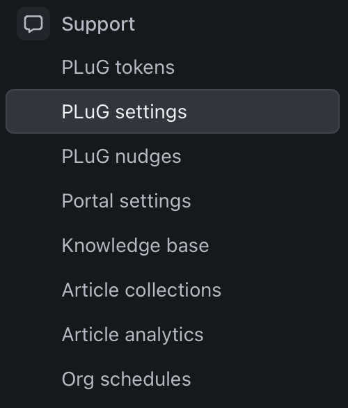

## Table of contents
- [Prerequisites](#prerequisites)
- [Installation](#installation)
- [Initialize DevRev SDK](#initialize-devrev-sdk)
- [Usage](#usage)
- [Sample app compile and run guide](#sample-app-compile-and-run-guide)
- [Configuration](#configuration)
- [Troubleshooting](#troubleshooting)


# Requirements

- Android Studio 2022.1.1
- Android Gradle Plugin version 7.4
- Gradle version 7.6
- Minimum Android SDK 29

# Setup

## Step 1

Add the following dependencies to your app's `build.gradle.kts` file to get the latest version of our SDK:
```kotlin
dependencies {
    implementation("ai.devrev.sdk:plug:0.9.6")
}
```

## Step 2
Since our SDK is hosted on Maven Central, all you need to do is add `mavenCentral()` to your repositories in root's `build.gradle.kts` file.

```kotlin
repositories {
    mavenCentral()
}
```

Now you should be able to import and use the DevRev SDK.


# Setting up the DevRev SDK
## Step 1: Credentials
In order to use the DevRev SDK you need the required credentials that can be found on the DevRev web app.
Open the Settings screen (gear icon), and then go to PLuG Setup under Support.



Under the App ID and Secret section you can create the credentials for use in the SDK.


## Step 2: Initialization
Once you have the credentials, you can configure the DevRev SDK in your app.

To configure the SDK, you need to call the following method inside your `Application` class:

```kotlin
fun DevRev.configure(
    context: Context, 
    appID: String, 
    secret: String, 
    organizationSlug: String
)
```

In case you do not have a custom `Application` class, you have to extend one like this:

```kotlin
import ai.devrev.sdk.DevRev

class FooApplication : Application() {

    override fun onCreate() {
        super.onCreate()
        DevRev.configure(
            context = this,
            appId = "<APP_ID>",
            secret = "<SECRET>",
            organizationSlug = "<ORG_SLUG>"
        )
    }
}
```
In the `onCreate` method in your `Application`, you need to configure the DevRev SDK with the required parameters. Here you need to use the credentials that we have created before.

Moreover, the custom application should be defined in `AndroidManifest.xml` like this:
```xml
<application
    android:name=".FooApplication">
</application>
```

# Features
Before you can use the PLuG support feature, you need to `identify` the user like this:
```kotlin
DevRev.identify(
    userIdentification = UserIdentification(userId = "foo@example.org")
)
```

Now you can use the support chat feature.

To open the support chat, you can call the function

```kotlin
DevRev.showSupport(context: Context)
```

Or you can include it in the view with the following code in your XML layout:
```xml
<ai.devrev.sdk.plug.view.PlugFloatingActionButton
    android:id="@+id/plug_fab"
    android:layout_width="wrap_content"
    android:layout_height="wrap_content"
    android:layout_margin="24dp"
    app:layout_constraintBottom_toBottomOf="parent"
    app:layout_constraintEnd_toEndOf="parent" />
```
The button can also accept default parameters like
`android:src="@your_drawable_here"`
and 
`android:backgroundTint="@your_background_color"`
so that you can customize it to your own needs.
The button will show up on your screen and by default, it should look like this:


You should now be able to run the app and use all the functionalities of the PLuG Support chat. The button click will navigate to the support chat.


# Sample app
A sample app with use cases for both function and XML implementation has been provided as part of this repository.

# Troubleshooting
In case you are having trouble with importing the DevRev SDK, check if you have the correct dependency, as well as Github maven URL in your root's project.

If the `showSupport()` function or XML button are not responding, make sure the user has been identified beforehand or if configuration accepted the right parameters for `appID` and `secret`.
